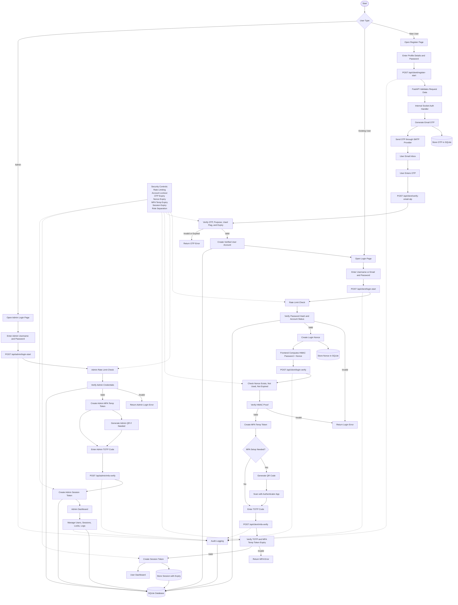

# Authentication Flow Diagram

This diagram shows the complete SecureAuth authentication flow, including user registration, email OTP verification, challenge-response login, QR/TOTP MFA, session creation, and admin authentication.

## Flow Summary

1. During registration, the user submits profile data and receives an OTP through the configured SMTP provider.
2. The backend stores the OTP in SQLite with expiry and purpose metadata.
3. After OTP verification, the account is created with email verification enabled.
4. During login, the backend verifies the password and generates a nonce.
5. The frontend computes an HMAC proof using the password and nonce.
6. The backend verifies the nonce, expiry, and HMAC proof before allowing MFA.
7. The user completes QR/TOTP MFA, then receives a session token with expiry.
8. Admin login is separated from user login and requires admin credentials plus MFA.
9. All important authentication, MFA, session, and admin actions are written to audit logs.

## Main Security Controls

- Password hashing before storage
- Email OTP verification with expiry
- Nonce-based challenge-response login
- HMAC proof verification
- QR/TOTP multi-factor authentication
- Temporary MFA token expiry
- Session token expiry
- Rate limiting for login and registration attempts
- Account lockout after repeated failures
- Admin and user privilege separation
- Audit logging for security events
