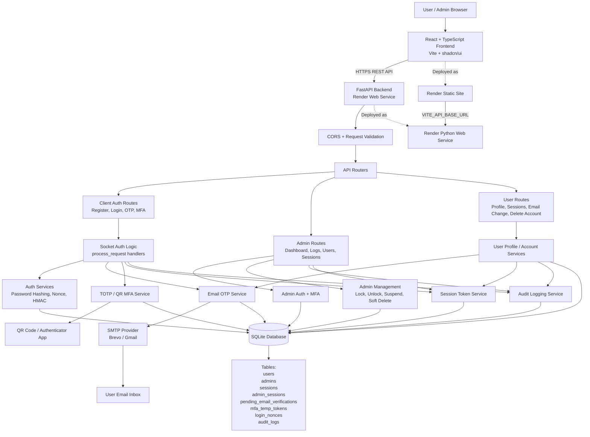

# System Architecture Diagram

This diagram shows the SecureAuth frontend, FastAPI backend, internal socket-auth logic, SQLite database, SMTP OTP service, MFA, sessions, audit logs, and Render deployment.

